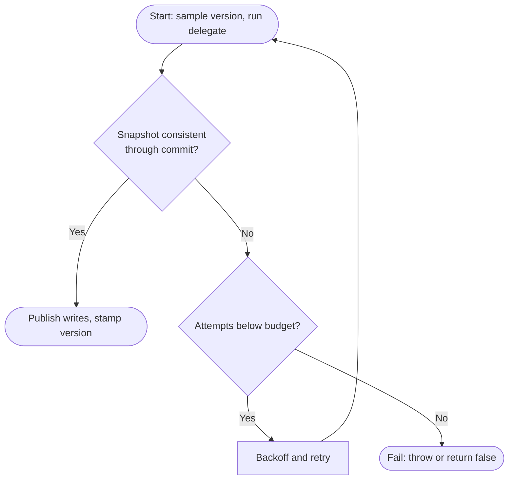
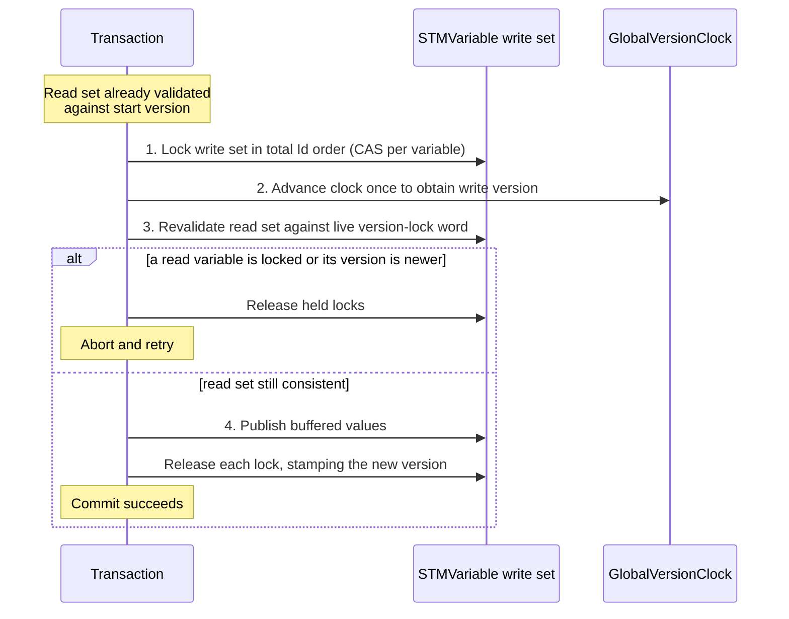
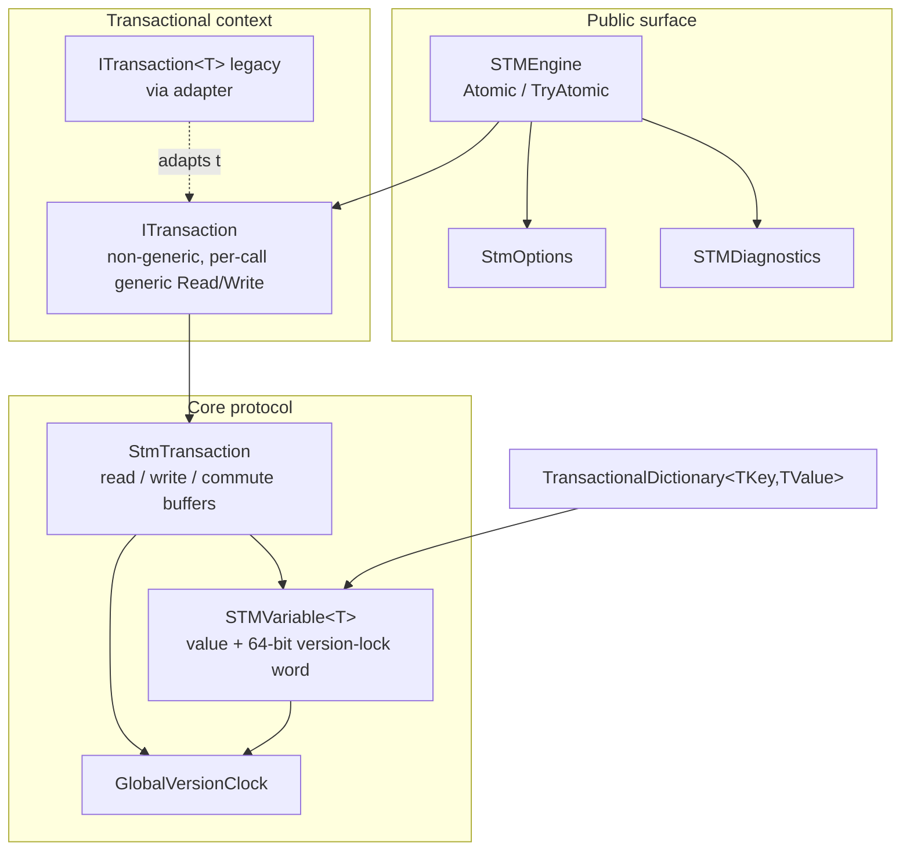

<div align="center">


**Composable, lock-free-in-userland concurrency for .NET, built on a TL2-style Software Transactional Memory engine.**

[](https://opensource.org/licenses/MIT)
[](https://www.nuget.org/packages/STMSharp)

[](https://github.com/engineering87/stmsharp/issues)
[](https://github.com/engineering87/stmsharp)

</div>

---

**STMSharp** brings Software Transactional Memory to .NET. You write concurrent logic as atomic transactions over shared variables, and the engine provides a consistent snapshot during execution, validates that snapshot at commit, and retries automatically under contention. There are no explicit locks in user code.

The engine implements a TL2-style protocol (Transactional Locking II). A transaction samples a version from a global clock at start, every read is validated against that version so the transaction always observes a consistent snapshot (opacity), and a read-write transaction commits by locking its write set in a deterministic order, revalidating its read set, then publishing its buffered values and stamping a new version.

## Table of contents

- [Why STMSharp](#why-stmsharp)
- [Features](#features)
- [Installation](#installation)
- [Quick start](#quick-start)
- [What is Software Transactional Memory](#what-is-software-transactional-memory)
- [How it works](#how-it-works)
  - [Transaction lifecycle](#transaction-lifecycle)
  - [The commit protocol](#the-commit-protocol)
- [Architecture](#architecture)
- [Core components](#core-components)
- [Composing transactions: retry, orElse, commute](#composing-transactions-retry-orelse-commute)
- [Consistency model](#consistency-model)
- [Backoff and contention](#backoff-and-contention)
- [Performance and when to use STMSharp](#performance-and-when-to-use-stmsharp)
- [Usage reference](#usage-reference)
- [Further documentation](#further-documentation)
- [Contributing](#contributing)
- [License](#license)
- [Contact](#contact)

## Why STMSharp

Lock-based concurrency forces the programmer to decide which locks protect which data, and to acquire them in a consistent order to avoid deadlock. That reasoning does not compose: two individually correct lock-based operations can deadlock when combined. STMSharp replaces explicit locking with atomic transactions. You describe what should happen atomically, and the engine handles isolation, conflict detection, and retry. Transactions compose, span several variables of different types, and support blocking coordination without hand-ordered locks.

STMSharp does not aim to be faster than a single lock on a single hot field. It aims to make correct multi-variable concurrency easy to express and to back that with a declared, verified consistency model. See [Performance and when to use STMSharp](#performance-and-when-to-use-stmsharp) for an honest account of where it wins and where a lock is the better tool.

## Features

- **Transaction-based memory model:** read and write shared variables without explicit locks.
- **Heterogeneous transactions:** a single transaction can read and write `STMVariable<T>` instances of different element types, because the transactional context is non-generic and its `Read<T>` and `Write<T>` methods are generic per call.
- **Opacity:** a running transaction never observes a torn or inconsistent intermediate state. An inconsistent read aborts and the transaction retries.
- **Atomic commit with conflict detection:** optimistic snapshot validation backed by a versioned write-lock word, with automatic retries up to a configurable budget.
- **Blocking composition:** `Retry` and `OrElse` express condition synchronization and alternatives, in the style of Composable Memory Transactions.
- **Commutative updates:** `Commute` applies an operation to a variable's committed value at commit time, so independent commuting updates do not conflict with one another.
- **Exception-free path:** `TryAtomic` reports retry-budget exhaustion through its return value instead of throwing, for hot contended loops.
- **Configurable backoff strategies:** `Exponential`, `ExponentialWithJitter` (default), `Linear`, `Constant`. The engine absorbs the first few retries with a sub-millisecond CPU spin and only reaches the timed ladder under sustained contention.
- **Read-only transactions:** validate snapshots without allowing writes, for read-heavy workloads.
- **Transactional dictionary:** `TransactionalDictionary<TKey, TValue>` with fine-grained per-key value concurrency and structural membership validation that prevents phantom reads.
- **Diagnostics:** process-wide conflict, retry, and unresolved-conflict counters via `STMDiagnostics`.

## Installation

STMSharp targets `net8.0` and `net10.0` and is distributed on NuGet.

```bash
dotnet add package STMSharp
```

## Quick start

```csharp
using STMSharp.Core;

var counter = new STMVariable<int>(0);

await STMEngine.Atomic(tx =>
{
    var value = tx.Read(counter);
    tx.Write(counter, value + 1);
});
```

The delegate runs against a consistent snapshot. If a concurrent transaction commits a change to `counter` before this one commits, the snapshot is invalidated, the delegate is retried automatically, and only a consistent result is published.

## What is Software Transactional Memory

Software Transactional Memory is a concurrency control mechanism that gives shared-memory programming an abstraction similar to database transactions. Operations on shared variables are grouped into a transaction that executes atomically, in isolation from other transactions, and the runtime detects conflicts and retries rather than requiring the programmer to acquire and order locks.

The core guarantees STMSharp provides are:

- **Atomicity:** a transaction either commits all of its writes or none of them.
- **Isolation:** a transaction observes a consistent snapshot and is not affected by concurrent uncommitted work.
- **Serializability:** committed transactions are equivalent to some serial order.
- **Opacity:** even a transaction that will eventually abort never observes an inconsistent state while running, so it cannot be driven into undefined behavior.

## How it works

`STMVariable<T>` stores a value together with a 64-bit versioned write-lock word. Bit 0 is the lock flag and the remaining bits hold the version, so a single atomic read observes both the lock state and the version at once. Versions are stamps drawn from a process-wide `GlobalVersionClock`, so they are comparable across all variables.

A transaction keeps append-only buffers rather than dictionaries: the read set (the distinct variables it has read), the write set (variables together with their pending values), and the commute set (variables with a pending commutative operation). For the small transactions typical of STM this allocates far less than hashing, and lookups are linear in the set size.

### Transaction lifecycle

A transaction samples a start version, executes the user delegate against a consistent snapshot, and then either commits or, if a read became inconsistent, unwinds and retries within its budget.



A read that observes an inconsistent snapshot during execution does not wait. It raises an internal retry signal that unwinds the user delegate, and the engine retries the whole transaction. This is how opacity is preserved.

### The commit protocol

Commit for a read-write transaction locks the write set in a deterministic total order, advances the clock once for a write version, revalidates the read set, then publishes and stamps. The total order over a stable per-variable identifier is what makes lock acquisition deadlock-free.



The read-set validation in step 3 is skipped when the write version is exactly one past the start version, because no other commit can have intervened. Read-only transactions, and read-write transactions with an empty write set, commit with no extra work, because every read was already validated against the start version.

## Architecture

The public surface (`STMEngine`, `StmOptions`, `STMDiagnostics`) sits above the transactional context (`ITransaction`, with the legacy `ITransaction<T>` adapting to it), which drives the core protocol over `STMVariable<T>` and the `GlobalVersionClock`.



## Core components

1. **`STMVariable<T>`**
   A shared value with a versioned write-lock word. Supports transactional access through the engine, plus `Read()`, `ReadWithVersion()`, `Version`, and a direct, protocol-compatible `Write(T)` (see [caveats](#consistency-model)).

2. **`ITransaction`**
   The non-generic transactional context passed to `STMEngine.Atomic`. Its `Read<T>(STMVariable<T>)` and `Write<T>(STMVariable<T>, T)` methods are generic per call, so one transaction can span variables of different element types. `Read` returns the transaction's own pending value if the variable was already written in the same transaction (read-your-own-writes). An instance is not thread-safe; concurrency is provided across distinct transactions, not within one.

3. **`ITransaction<T>` (legacy)**
   The single-type context, retained for source compatibility. It delegates to the non-generic core through an internal adapter, so existing code continues to compile and run unchanged. New code should prefer `ITransaction`.

4. **`STMEngine`**
   The public façade. It exposes `Atomic(...)` overloads (synchronous `Action<ITransaction>`, asynchronous `Func<ITransaction, Task>`, and value-returning `Func<ITransaction, Task<TResult>>`), each with either explicit retry and backoff parameters or an `StmOptions` argument, plus the legacy single-type overloads. It also exposes the exception-free `TryAtomic(...)` surface. When the retry budget is exhausted, `Atomic` throws `TransactionConflictException` while `TryAtomic` reports the outcome through its return value.

5. **`StmOptions`**
   Immutable configuration: `MaxAttempts`, `BaseDelay`, `MaxDelay`, `Strategy` (`BackoffType`), and `Mode` (`TransactionMode.ReadWrite` or `ReadOnly`). `StmOptions.Default` and `StmOptions.ReadOnly` are provided, and `with` expressions create modified copies.

6. **`STMDiagnostics`**
   Process-wide counters: `GetConflictCount()`, `GetRetryCount()`, `GetUnresolvedConflictCount()`, and `Reset()`. Generic overloads are retained for source compatibility and ignore their type argument.

7. **`TransactionalDictionary<TKey, TValue>`**
   A transactional map with per-key value cells and a structural directory that prevents phantom reads. A value update on an existing key is O(1) and does not conflict with updates to other keys; a structural change copies the directory and conflicts with concurrent operations that observed it.

## Composing transactions: retry, orElse, commute

STMSharp provides the composable blocking operators introduced by Composable Memory Transactions, plus commutative updates.

- **`Retry`** abandons the current attempt and blocks until one of the variables in the read set changes, then re-executes. It expresses condition synchronization (for example, wait until a queue is non-empty) without polling.
- **`OrElse`** runs a first transaction, and if that one blocks via `Retry`, runs a second alternative instead. It composes two blocking transactions into one.
- **`Commute`** registers a commutative operation (for example, increment) applied to the variable's committed value under lock at commit time. Two transactions that only commute the same variable do not conflict logically with one another.

The design and semantics of these operators are documented in [docs/design-retry-orelse-commute.md](docs/design-retry-orelse-commute.md), and their guarantees are stated in the [consistency model](docs/consistency-model.md).

## Consistency model

STMSharp provides serializability and opacity. Committed transactions are equivalent to some serial order, and a transaction in progress only ever observes a consistent snapshot, so it cannot be driven into undefined behavior by a concurrent commit before it aborts. The normative specification, including the formal guarantees and their boundaries, is in [docs/consistency-model.md](docs/consistency-model.md).

A few boundaries are worth stating here:

- **Mutable reference types.** If `T` is a mutable reference type and code mutates the referenced object without going through `Write`, the version does not change and isolation is broken. Prefer immutable values, or treat `T` as a value and always replace it through `Write`.
- **Direct `Write(T)`.** The non-transactional `Write` on a variable follows the same lock protocol, so it is safe with respect to concurrent transactions, but it bypasses transactional composition and conflict semantics. Use it for initialization or for genuinely independent single-variable updates, not as a substitute for a transaction.
- **Retry of the delegate.** Because a transaction can be retried, the delegate must be free of irreversible side effects, or those side effects must be idempotent.
- **Budget exhaustion.** When a transaction cannot commit within `MaxAttempts`, the `Atomic` entry points throw `TransactionConflictException`, while the `TryAtomic` entry points report the failure through the return value without throwing. No writes are published on a failed commit.
- **Transactional dictionary cost.** A value update on an existing key is O(1) and does not conflict with updates to other keys. A structural change (insertion or removal) copies the directory and is O(n) in the number of keys, and it conflicts with any concurrent operation that observed the directory.

## Backoff and contention

When a commit fails because of a conflict, the engine waits before retrying. The first retries are absorbed by a bounded CPU spin and a single cooperative yield, both on the microsecond scale and free of any operating-system timer. Only sustained contention reaches the configured timed ladder. This matters because a sub-quantum `Task.Delay` is rounded up to the system timer tick (about 15 ms on Windows), so a naive timed backoff would make a single conflict cost milliseconds. Pushing the early retries onto a spin keeps contended transactions on the microsecond scale.

`ExponentialWithJitter` is full-jitter: the delay is uniform in the range up to the capped exponential value, which breaks synchronized retry storms across concurrent transactions.

## Performance and when to use STMSharp

Performance is measured with [BenchmarkDotNet](https://benchmarkdotnet.org/), covering execution time, allocations, and GC activity. The comparison is deliberately limited to a lock-based baseline, the reference every .NET developer already knows. The honest summary is that STMSharp does not exist to be faster than a lock on a small, hot critical section, and the measurements bear that out.

What the measurements show, on an Intel Core Ultra 7 155H, .NET 10, with sixteen threads each performing a thousand increments:

- On a single, maximally contended counter, a plain `lock` is the fastest option. STMSharp with read-modify-write transactions is roughly two to three times slower, and the commutative path is slower still under that specific contention because every commit must serialize on the same variable. This is the worst case for optimistic STM: there is no disjoint work to parallelize, so the transactional machinery pays its overhead without being able to collect its only advantage.
- On disjoint access, where each thread works on its own cell, a single global lock needlessly serializes independent work, but STMSharp does not beat it either, because the dominant cost is a fixed per-transaction allocation rather than contention.
- Across every workload measured, STMSharp allocates substantially more per operation than a lock. This is a known characteristic and the reason the library does not claim a performance advantage.

So STMSharp earns its place not on raw speed but on what a lock does not give you for free: composable atomic transactions over several variables at once, with automatic conflict detection and retry, blocking composition (`Retry` and `OrElse`), and a declared, verified consistency model. If you need many independent locks coordinated correctly, or condition synchronization without hand-ordering locks, that is where it helps. If you need to protect one small hot field, a `lock` is simpler and faster, and you should use it.

The measurement methodology and the direction of future work are in [the roadmap](docs/roadmap.md). Internal microbenchmarks of the backoff strategies are in the [benchmark report](docs/benchmarks/benchmarks.md).

## Usage reference

**Basic transaction**

```csharp
var sharedVar = new STMVariable<int>(0);

await STMEngine.Atomic(tx =>
{
    var value = tx.Read(sharedVar);
    tx.Write(sharedVar, value + 1);
});
```

**Heterogeneous transaction across element types**

```csharp
var balance = new STMVariable<int>(0);
var name    = new STMVariable<string>("");

await STMEngine.Atomic(tx =>
{
    tx.Write(balance, tx.Read(balance) + 10);
    tx.Write(name, "updated");
});
```

**Returning a value**

```csharp
var account = new STMVariable<int>(100);

int balance = await STMEngine.Atomic(async tx =>
{
    await Task.Yield();
    return tx.Read(account);
});
```

The value-returning overload takes an asynchronous body, `Func<ITransaction, Task<TResult>>`. A synchronous-result overload is intentionally not offered, because it is ambiguous for any lambda that returns a `Task`. For a synchronous transaction that produces a value, capture it through the void overload:

```csharp
int balance = 0;
await STMEngine.Atomic(tx => { balance = tx.Read(account); });
```

**Exception-free transaction**

```csharp
var sharedVar = new STMVariable<int>(0);

bool committed = await STMEngine.TryAtomic(tx =>
{
    tx.Write(sharedVar, tx.Read(sharedVar) + 1);
});

// Value form returns a tuple instead of throwing on budget exhaustion.
var (ok, value) = await STMEngine.TryAtomic(async tx =>
{
    await Task.Yield();
    return tx.Read(sharedVar);
});
```

**Read-only mode and custom options**

```csharp
var sharedVar = new STMVariable<int>(0);

// Read-only transaction (throws if Write is called)
await STMEngine.Atomic(tx =>
{
    var value = tx.Read(sharedVar);
    Console.WriteLine($"Current value: {value}");
}, StmOptions.ReadOnly);

// Custom retry and backoff policy
var options = new StmOptions(
    MaxAttempts: 5,
    BaseDelay: TimeSpan.FromMilliseconds(50),
    MaxDelay: TimeSpan.FromMilliseconds(1000),
    Strategy: BackoffType.ExponentialWithJitter,
    Mode: TransactionMode.ReadWrite);

await STMEngine.Atomic(tx =>
{
    var value = tx.Read(sharedVar);
    tx.Write(sharedVar, value + 1);
}, options);
```

**Transactional dictionary**

```csharp
var dict = new TransactionalDictionary<string, int>();

await STMEngine.Atomic(tx =>
{
    dict.Set(tx, "a", 1);
    dict.Set(tx, "b", 2);
});

int a = 0;
await STMEngine.Atomic(tx => a = dict.Get(tx, "a"));
```

**Diagnostics**

```csharp
STMDiagnostics.Reset();

// Run some atomic operations...

var conflicts  = STMDiagnostics.GetConflictCount();
var retries    = STMDiagnostics.GetRetryCount();
var unresolved = STMDiagnostics.GetUnresolvedConflictCount();

Console.WriteLine($"Conflicts: {conflicts}, Retries: {retries}, Unresolved: {unresolved}");
```

## Further documentation

- [Architecture](docs/architecture.md) — the internal design and the TL2-style algorithm in detail.
- [Consistency model](docs/consistency-model.md) — the normative specification of the guarantees STMSharp provides and their boundaries.
- [Design of retry, orElse, and commute](docs/design-retry-orelse-commute.md) — the design and semantics of the blocking and commutative operators.
- [Roadmap](docs/roadmap.md) — direction of the project, the lock-only benchmarking stance, and the measured rationale behind performance decisions.
- [Diagram sources](docs/diagrams) — the Mermaid sources for the diagrams in this README.

## Contributing

Contributions are welcome. Please read [CONTRIBUTING.md](CONTRIBUTING.md) for the development workflow and the expectations for code changes, which are held to a high standard because STMSharp is a concurrency library. Participation is governed by the [Code of Conduct](CODE_OF_CONDUCT.md), and security issues should be reported following the [Security Policy](SECURITY.md).

- [Open an issue](https://github.com/engineering87/stmsharp/issues) if you encounter a bug or have a suggestion
- [Fork the repository](https://docs.github.com/en/pull-requests/collaborating-with-pull-requests/working-with-forks/fork-a-repo) and open a pull request for review

## License

STMSharp source code is available under the MIT License. See the license in the source.

## Contact

Please contact francesco.delre[at]protonmail.com for any details.
